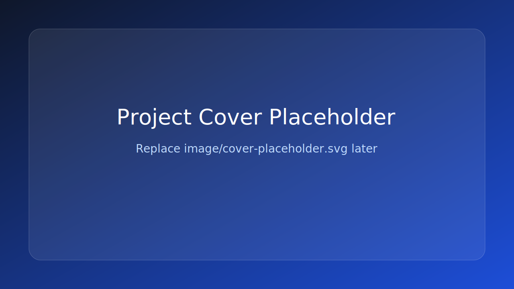
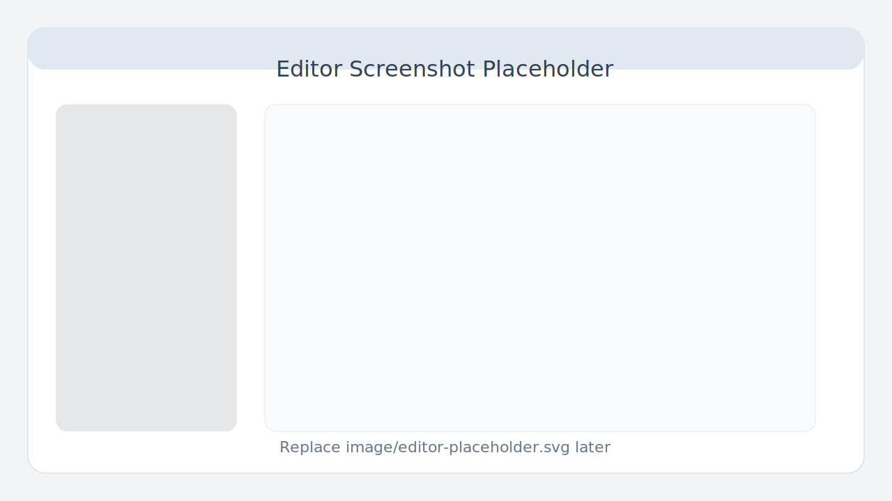
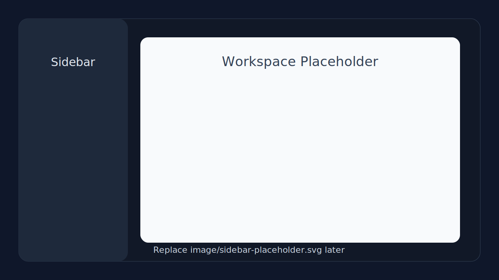

# MarkText Modern

<p align="center">
  
</p>

<p align="center">
  一个基于 <strong>MarkText</strong> 二次开发的现代化 Markdown 编辑器项目，目标是用更清晰的 Electron + Vite + Vue 3 + TypeScript 架构，承接原有编辑体验并持续演进。
</p>

<p align="center">
  <a href="README.md">English</a>
</p>

<p align="center">
  <a href="LICENSE"></a>
  
  
  
</p>

## 项目简介

`MarkText Modern` 是一个基于开源项目 **MarkText** 继续演进的现代化重构版本。

这个仓库保留了原项目优秀的 Markdown 编辑能力，同时逐步将应用迁移到更易维护、更适合长期开发的技术栈上，包括：

- Electron 桌面应用架构
- Vite 构建与开发体验
- Vue 3 渲染层
- TypeScript 类型约束
- 对旧版 Muya 编辑器能力的桥接与渐进迁移

这个项目的重点不是“一次性推翻重写”，而是：

- 降低历史代码耦合
- 明确主进程、预加载、渲染层边界
- 提升可维护性与可扩展性
- 为后续功能迭代打下更稳定的基础

## 项目亮点

- 基于 `modern/` 目录构建现代化应用主线
- 使用 Vue 3 组织渲染层功能模块
- 使用 TypeScript 强化跨进程契约和重构安全性
- 对 Electron `main / preload / renderer` 做更清晰的职责拆分
- 通过桥接方式复用 legacy editor 能力，避免粗暴重写
- 支持渐进式迁移，适合持续迭代

## 目录结构

```text
.
|- image/                 README 展示图片目录
|- modern/                现代化应用入口与主要开发目录
|  |- src/main/           Electron 主进程
|  |- src/preload/        预加载层与桥接接口
|  |- src/renderer/       Vue 3 渲染层
|  |- src/shared/         共享契约与公共类型
|- src/main/              旧版主进程实现
|- src/renderer/          旧版渲染层实现
|- src/muya/              旧版编辑器核心
```

## 界面预览

下面这些图片是占位图，后续你可以直接替换 `image/` 目录下同名文件：

### 1. 项目封面



### 2. 编辑器主界面



### 3. 侧边栏与工作区



## 快速开始

### 环境要求

- Node.js
- npm

### 安装依赖

```bash
npm install
npm --prefix modern install
```

### 启动现代化版本

```bash
npm run modern:dev
```

### 构建现代化版本

```bash
npm run modern:build
```

### 类型检查

```bash
npm run modern:typecheck
```

## 为什么要做这个项目

原始的 MarkText 项目已经具备非常成熟的 Markdown 编辑体验，但随着历史代码积累，维护和扩展的成本也越来越高。这个项目的意义在于：

- 用更现代的工程结构承接原有能力
- 让复杂逻辑的边界更加清晰
- 让重构和功能开发风险更低
- 为未来的大规模迭代保留空间

## 原项目说明

本项目基于原始开源项目 **MarkText** 进行二次开发和现代化改造。

- 原项目地址：[marktext/marktext](https://github.com/marktext/marktext)
- 原项目作者及贡献者保留其对应的开源贡献署名

如果你想查看原版项目、历史发布版本或参与上游社区，请前往原始仓库。

## License

本项目使用 [MIT License](LICENSE)。

原始 MarkText 项目同样采用 MIT 协议。基于原项目继续分发或修改时，请保留相关版权与许可证声明。
