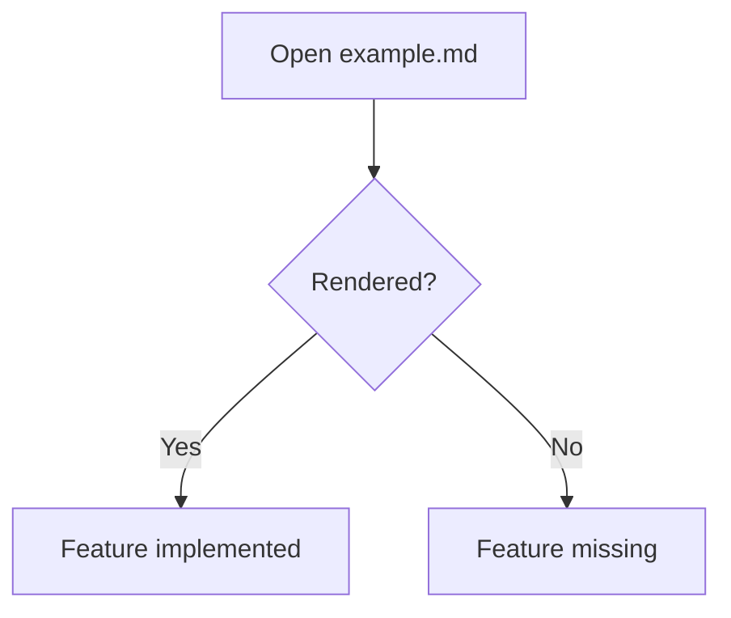

# Markdown Rendering Verification

This file is the default `example.md` document.

Use it as a visual checklist:

- If a section renders correctly, that feature path is working.
- If a section is plain text or broken, that renderer/parser path is missing.

---

## 1. Paragraphs And Line Breaks

This is a normal paragraph with **strong**, *emphasis*, ***strong emphasis***, and `inline code`.

This paragraph contains a hard line break after this sentence.  
This line should start immediately below it.

Backslash escapes should work: \*not italic\*, \[not a link\], and \`not code\`.

HTML entities should work: &copy; &amp; &lt; &gt;.

---

## 2. Headings

### ATX Heading Level 3

#### ATX Heading Level 4

Setext Heading Level 1
======================

Setext Heading Level 2
----------------------

---

## 3. Links

Inline link: [CommonMark](https://commonmark.org/)

Autolink: <https://github.com/marktext/marktext>

Reference link: [GitHub Docs][github-docs]

[github-docs]: https://docs.github.com/

---

## 4. Lists

### Unordered List

- Item A
- Item B
  - Nested Item B.1
  - Nested Item B.2
- Item C

### Ordered List

1. First
2. Second
3. Third

### Mixed List

1. Ordered parent
   - Unordered child
   - Another child
2. Ordered sibling

### Task List (GFM)

- [x] Completed task
- [ ] Pending task
- [x] Nested tasks
  - [x] Child done
  - [ ] Child pending

---

## 5. Blockquotes

> Single-level blockquote.
>
> Second paragraph inside the same quote.

> Nested quote:
>
> > Level 2 quote
> >
> > - Quoted list item
> > - Another quoted item

---

## 6. Code

### Fenced Code Block

```ts
type User = {
  id: string
  name: string
  active: boolean
}

const users: User[] = [
  { id: 'u1', name: 'Ada', active: true },
  { id: 'u2', name: 'Linus', active: false }
]

console.log(users.filter(user => user.active))
```

### JSON

```json
{
  "name": "marktext-modern",
  "runtime": {
    "node": "24.x",
    "electron": "41.x"
  }
}
```

### YAML

```yaml
editor:
  spellcheck: true
  focusMode: false
  markdown: commonmark+gfm
```

### Bash

```bash
npm run modern:dev
npm run modern:build
```

### Indented Code Block

    function indentedCodeBlock() {
      return 'This should render as code.'
    }

---

## 7. Tables (GFM)

| Feature | Type | Expected |
| --- | --- | --- |
| Paragraphs | CommonMark | Rendered |
| Tables | GFM | Rendered |
| Task Lists | GFM | Rendered |
| Math | Extension | Rendered if supported |

| Align Left | Align Center | Align Right |
| :--- | :---: | ---: |
| A | B | C |
| 1 | 2 | 3 |

---

## 8. Images

Inline SVG data URI image:


---

## 9. Horizontal Rule

Above this section and below this paragraph there should be a thematic break.

---

## 10. Raw HTML

<kbd>Ctrl</kbd> + <kbd>S</kbd>

<mark>Highlighted HTML text</mark>

<details>
  <summary>Expandable HTML block</summary>
  <p>This content should be inside a collapsible block if HTML rendering is enabled.</p>
</details>

---

## 11. Strikethrough And Mixed Inline Syntax

This line includes ~~strikethrough~~, **bold**, *italic*, and a [link with `inline code`](https://example.com/).

Combination test: **bold and *nested italic* text**.

---

## 12. Footnotes (Extension)

Footnote reference[^note1] and another footnote[^note2].

[^note1]: This is the first footnote.
[^note2]: This is the second footnote with **formatting**.

---

## 13. Definition-Like Reference Stress

Repeated reference link usage: [GitHub Docs][github-docs], [GitHub Docs][github-docs], [GitHub Docs][github-docs].

---

## 14. Math (Extension)

Inline math: $E = mc^2$

Inline chemistry-like math: $H_2O$

Block math:

$$
\int_0^1 x^2 \, dx = \frac{1}{3}
$$

Matrix:

$$
\begin{bmatrix}
1 & 2 \\
3 & 4
\end{bmatrix}
$$

---

## 15. Mermaid (Extension)



---

## 16. Flowchart.js (Extension)

```flowchart
st=>start: Start
op=>operation: Render feature
cond=>condition: Looks correct?
done=>end: Done

st->op->cond
cond(yes)->done
cond(no)->op
```

---

## 17. Sequence Diagram (Extension)

```sequence
Alice->Bob: Hello Bob
Bob-->Alice: Hello Alice
```

---

## 18. Vega-Lite (Extension)

```vega-lite
{
  "$schema": "https://vega.github.io/schema/vega-lite/v5.json",
  "description": "Simple bar chart",
  "data": {
    "values": [
      { "feature": "CommonMark", "count": 8 },
      { "feature": "GFM", "count": 5 },
      { "feature": "Extensions", "count": 5 }
    ]
  },
  "mark": "bar",
  "encoding": {
    "x": { "field": "feature", "type": "nominal" },
    "y": { "field": "count", "type": "quantitative" }
  }
}
```

---

## 19. Final Checklist

- [ ] Paragraphs
- [ ] Headings
- [ ] Links
- [ ] Lists
- [ ] Task lists
- [ ] Blockquotes
- [ ] Code fences
- [ ] Indented code
- [ ] Tables
- [ ] Images
- [ ] Raw HTML
- [ ] Strikethrough
- [ ] Footnotes
- [ ] Math
- [ ] Mermaid
- [ ] Flowchart
- [ ] Sequence
- [ ] Vega-Lite

If something above is missing, broken, unstyled, or still plain text, that feature has not been fully migrated yet.
